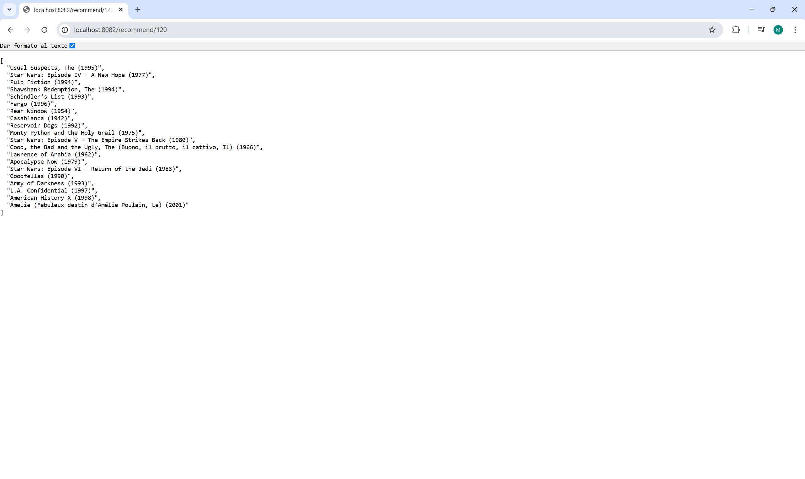
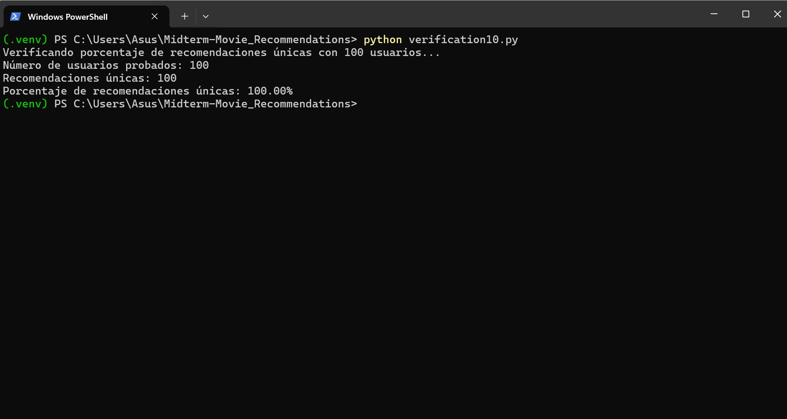
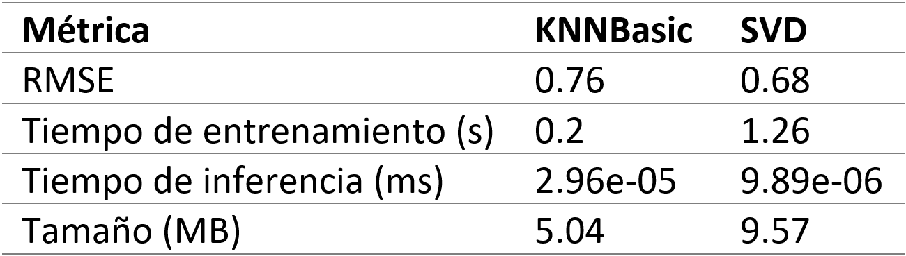

# Midterm - Movie Recommendations

## Milestone 1: Recommendation Model and First Deployment

### Learning goals:

- [ ] Collect data from multiple sources and engineer features for learning
- [ ] Apply state of the art machine learning tools
- [ ] Deploy a model inference service
- [ ] Measure and compare multiple quality attributes of your model

Request recommendation result:

Personalized recommendations testing:

Performance comparison between models:

